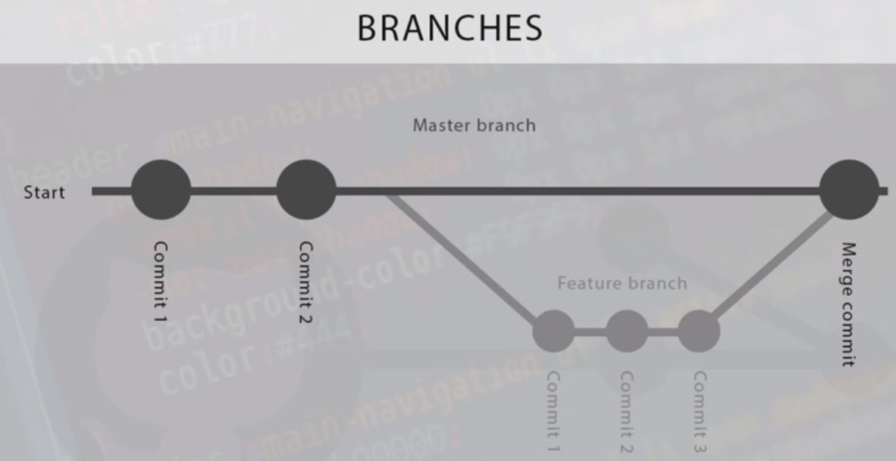

# Warmup

> "Getting acquainted with your ecosystem"

I remember one of my first days of work at Intel. The entire day was spent getting my Integrated Development Environment (IDE) setup, installing software, installing libraries and Application Programming Interfaces(APIs), and getting acquainted with a new software ecosystem. It can be slightly overwhelming at first, but eventually you settle into your environment, and having a good environment and tools can increase your productivity later on.

For your first warmup exercise, you will be getting acquainted with part of your environment: Git and DLang.

# Implementation Logistics

- You may use whatever operating system, IDE, or tools for completing this assignment.
	- However, my instructions will usually be using the command-line, and that is what I will most easily be able to assist you with.
- In the future there may be restrictions, so please review the logistics each time.

# Resources to help

Provided below are a list of curated resources to help you complete the tasks below. Consult them (read them, or do ctrl+f for keywords) if you get stuck.

1. https://tour.dlang.org/
	- A great introduction to the D programming language one lesson at a time.
2. https://dlang.org/phobos/index.html
	- A more complete guide to the Phobos standard library. You'll find lots of useful videos there!
3. https://www.youtube.com/playlist?list=PLvv0ScY6vfd9Fso-3cB4CGnSlW0E4btJV
	- My video series on the D Programming Language -- over time growing!
4. My introduction to git and github in 23 minutes (useful for this course)
	- https://www.youtube.com/watch?v=PgNTp71sl0I
5. My Git Beginner Masterclas
	- https://www.youtube.com/watch?v=HlYJpuwaXiE
6. More Git videos: 
	- A Useful playlist of git tutorials.
		- https://www.youtube.com/watch?v=3RjQznt-8kE&list=PL4cUxeGkcC9goXbgTDQ0n_4TBzOO0ocPR
	- Tutorial on creating branches 
		- https://www.youtube.com/watch?v=QV0kVNvkMxc
	- Tutorial on merging branches 
		- https://www.youtube.com/watch?v=XX-Kct0PfFc
	- Moving branches upstream: 
		- https://www.git-tower.com/learn/git/faq/set-upstream

# Task 0 - Installing the DMD compiler.

In order to get started in this course, we are going to need a compiler that can understand D code.

- Search on the web for "DMD compiler download" or directly visit: https://dlang.org/download.html
- While there are several compilers, I'll recommend DMD for this course. If you later want to use LDC or GDC you are welcome to try those out. 

Once you have successfully installed the DMD compiler, try it out on the termianl.

- Create a file called [main.d](./main.d) anywhere on your machine (you do not need to commit this file to this repository)
- ```d
	import std.stdio;
	
	void main(){
		writeln("Hello, the compiler works");	
	}
	```
- Try to then run with either:
	- `dmd main.d -of=prog` (Note windows users may need to type: `-of=prog.exe`)
		- Then type: `./prog` (Note windows uses can type `prog.exe`)
	- `rdmd main.d`

- If you see "Hello, the compiler works" in your terminal, you should be all set.

# Task 1 - Git basics

## Git and Github

You may already be familiar with Git, but here is a refresher to get you started with obtaining your repository on your local machine.

I don't care in this course if you use a Git Graphical User Interface(GUI) or some other tool, but I will be showing and working in the command line how to use git most of the time. The commandline in general will also be my recommended way of working in this course -- it gives you more power and will allow you to automate tasks in git.

### Git

[What is Git](https://www.atlassian.com/git/tutorials/what-is-git)? Git is the most widely used modern version control system. Typically it is used to manage different versions of text-based files (though it can manage any set of data).

### Github

Github.com ('Github' for short) is the webhost for a software version control system called 'git'. Github in fact, is the website you are on now!

## Obtaining your repository

1. Run `git clone your_repository_url` to establish a git repository on your system. *your_repository_url* is found by clicking the 'green' button on you Monorepo homepage(move one directory up from this folder).
	- It should look something like `https://github.com/CourseName/Monorepo-yourname.git`
2. When you make a change to a file within this directory you can see what is different by:
	- run `git status` to see what you have changed locally on your computer. 
	- Changes you have made locally have not yet been saved to github's servers. 
3. When you are happy with your changes do `git add whatever_file.d` which prepares that specific file to be added to the main branch. [[git add documentation](https://git-scm.com/docs/git-add)]
4. Next, you will do `git commit -m "some informative message about your changes"` to record changes in your repository [[git-commit documentation](https://git-scm.com/docs/git-commit)]
5. Finally, do a `git push` to actually make things happen--meaning everything you have added will go to the github server. You can check your github.com repository to see exactly what I will see. [[git push documentation](https://git-scm.com/docs/git-push)]

A cheatsheet has been added to the repository (In the [Cheatsheets directory](./../Cheatsheets/git-cheat-sheet-education.pdf)) that may be helpful in explaining these commands further.

# Task 2 - DLang basics and Git

For this task you are going to be compiling your first D code on the terminal. We will now be refactoring some D code and practicing our git skills as well.

**However** Some of the engineers are unsure if they like are going to like the proposed refactorings below, so they want you to instead make the refactorings in a separate branch first, and then merge your changes into the main branch.

## Prompt - Code Review and Refactorings

After you have downloaded your repository, you find that you have a piece of code in this lab folder called [/src/rectangle.d](./src/rectangle.d). Your colleague (a senior software engineer) has asked you to make the following code refactorings in a separate branch before merging:

1. rename the variables 'width' and 'height' to 'mWidth' and 'mHeight'
	- This better indicate that they are member variables in a class or struct (The `m` prefix typically indicates this). 

## How to Complete Your Next Task

1. Create a new branch called 'refactor'and make the suggested refactoring to [/src/rectangle.d](./src/rectangle.d). 
2. Merge in the new rectangle.d into the main branch after making the suggested refactoring from your 'refactor' branch. 

### Creating ew branch and merging to main



Roughly speaking git works like a tree. There is a main branch called the 'main branch' where the most up-to-date and stable version of code lives. When engineers work on features (often many working on different at a time), they can create a separate branch of code and merge it into the main branch when the feature is ready. This generally allows engineers to seperate out tasks efficiently, and is what we will want to start practicing for our workflow for this course. Provided below are some helpful commands of what you will need to do.

```bash
# Show what branch we are on
# Typically this is origin/main
git status

# Show our previous commits and messages (Some of these which I made)
# Press 'q' to exit. Use arrows to move up and down through history.
git log --oneline

# Shows all the branches and which you are working on.
# You may notice we do not have a 'refactor' branch yet.
git branch -a

# Let's create a separate branch to work on.
git branch refactor

# Show branches we have to confirm it was made
git branch -a

# Switch to a different development branch
# In this case, our 'refactor'
git checkout refactor

# View which branch we are on again to confirm
# (or use 'git status')
git branch -a

# Do a git status to see the changes
git status

# Let's now make a change to our file in our source(src) directory
# (Use vim or whichever text editor to update the code.)
# That is, go ahead and refactor ./warmup/src/rectangle.d from within your 'refactor' branch.

# After you have refactored rectangle.d
# Check which files have been modified again with
git status

# Add the change to the branch
# git add rectangle.d or 'git add .'
git add . 

# Add a commit message
git commit -m "rectangle.d refactored" 

# Now we are going to push your changes 'upstream' in 
# a separate branch. The '-u' argument sets us up
# to push changes upstream, or otherwise to 
# be tracked by github.com. This means our branch
# that has only been created on our 'local' machine,
# will now be accessible on a remote machine.
git push -u origin refactor

# ---------------------------------------
# Pause now for a moment, and go to github.com in your repository.
# Towards the left-corner of your repository, click 'main' and
# see that your 'refactor' branch is an option in the drop-down.
# If you navigate to your lab/src  directory where retangle.d 
# resides, you should note that the main and refactor branches
# are different.

# At this point, assume another 'code review' takes place, and your
# team accepts your changes.
# Let's now merge your 'in-development' 'refactor' branch with the
# 'main' branch.
# ---------------------------------------

# Move back to the main branch where we want to merge changes
git checkout main

# merge in new code changes from our feature branch into
# our main branch
# You should get a conflict, so we will help it decide.
# which version to keep. You can simply save in the new version.
git merge refactor

# Then push your changes into the main branch, such that I should see src/rectangle.d
# with the changes that have been made in the 'refactor' branch.
git push

```

Note, this workflow of working in a separate branch and then merging into a main branch is the ideal workflow for many companies, especially in larger pieces of software where many developers are working on the same software. I suggest you practice this, even when working solo on a project.

## Testing

We will be looking at your code to see that you have a 'refactor' branch in your repository, and that you have that same code merged into your main branch.

# Submission/Deliverables

### Submission

- Commit all of your files to github, including any additional files you create.
- Do not commit any binary files unless told to do so.
- Do not commit any 'data' files generated when executing a binary.

### Deliverables

- Create a 'refactor' branch (We should be able to see it on github.com)
- Commit your refactored [/src/rectangle.d](./src/rectangle.d) file to the main branch.

# Going Further

An optional task(if any) that will reinforce your learning throughout the semester--this is not graded.

1. N/A

# F.A.Q. (Instructor Anticipated Questions)

- Q. N/A
	- A. N/A

# Found a bug?

If you found a mistake (big or small, including spelling mistakes) in this lab, kindly send me an e-mail. It is not seen as nitpicky, but appreciated! (Or rather, future generations of students will appreciate it!)

- Fun fact: The famous computer scientist Donald Knuth would pay folks one $2.56 for errors in his published works. [[source](https://en.wikipedia.org/wiki/Knuth_reward_check)]
- Unfortunately, there is no monetary reward in this course :)
