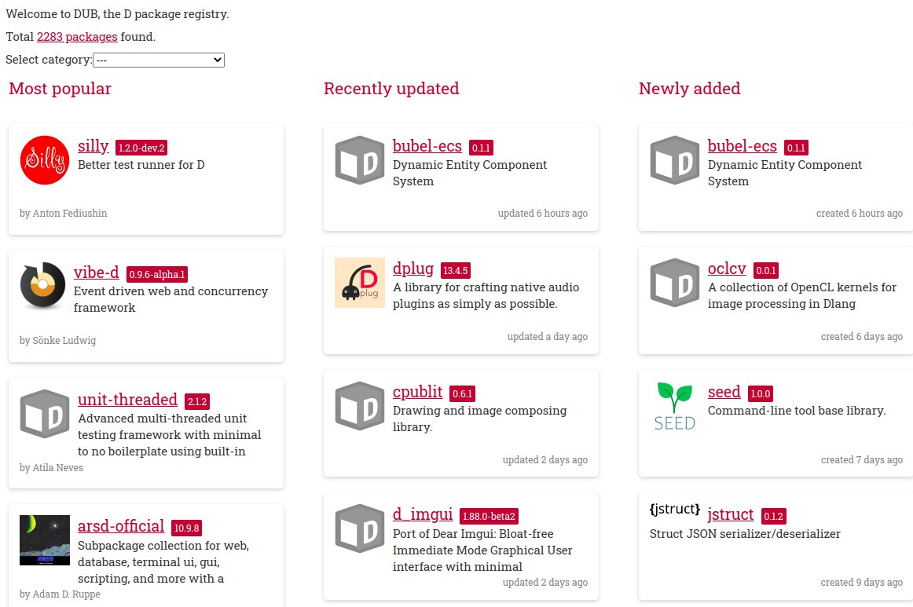
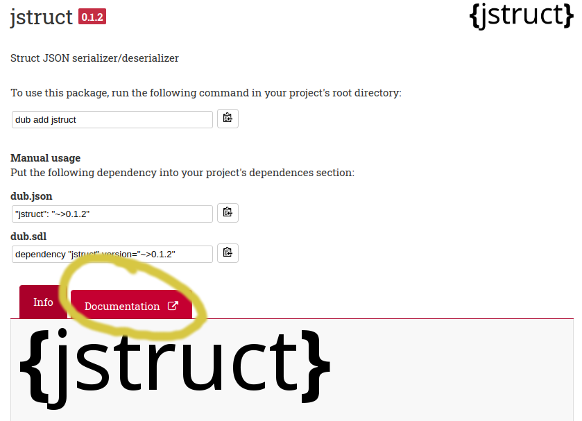
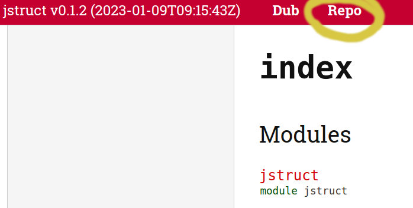

# Warmup

> "Reading Code"

I was recently discussing with some senior level engineers about what skills are missing in software engineers. Some of the skills mentioned like debugging is something we will soon cover. But the one that kept coming up over an dover again, was the wish that graduates had spent more time reading code. Today I'm going to give you a chance to spend some time reading code.

For the **warmup only** portion of the assignment, you're welcome to work with someone nearby, or you may otherwise work alone.

# Implementation Logistics

- You may use whatever operating system, IDE, or tools for completing this assignment.
	- However, my instructions will usually be using the command-line, and that is what I will most easily be able to assist you with.
- In the future there may be restrictions, so please review the logistics each time.

# Resources to help

Provided below are a list of curated resources to help you complete the tasks below. Consult them (read them, or do ctrl+f for keywords) if you get stuck.

1. https://tour.dlang.org/
	- A great introduction to the D programming language one lesson at a time.
2. https://dlang.org/phobos/index.html
	- A more complete guide to the Phobos standard library. You'll find lots of useful videos there!
3. https://www.youtube.com/playlist?list=PLvv0ScY6vfd9Fso-3cB4CGnSlW0E4btJV
	- My video series on the D Programming Language -- over time growing!
4. My introduction to git and github in 23 minutes (useful for this course)
	- https://www.youtube.com/watch?v=PgNTp71sl0I
5. My Git Beginner Masterclas
	- https://www.youtube.com/watch?v=HlYJpuwaXiE
6. More Git videos: 
	- A Useful playlist of git tutorials.
		- https://www.youtube.com/watch?v=3RjQznt-8kE&list=PL4cUxeGkcC9goXbgTDQ0n_4TBzOO0ocPR
	- Tutorial on creating branches 
		- https://www.youtube.com/watch?v=QV0kVNvkMxc
	- Tutorial on merging branches 
		- https://www.youtube.com/watch?v=XX-Kct0PfFc
	- Moving branches upstream: 
		- https://www.git-tower.com/learn/git/faq/set-upstream

# Task 0 - Finding Code

The first thing that you are going to need to do is find code. Luckily, DLang has a centralized package manager called DUB. The DUB Package repository maintains a list of projects that can be easily installed using the DUB package manager.

The DUB repository is here [https://code.dlang.org/], and you can find many projects there.

# Task 1 - Code Review

During a Code Review, typically you'll be looking at specific commit messages to evaluate changes from a 'git commit message'. That is one reason when you commit in Git it is so important to write a descriptive message, especially when working in a team for the changes you have made on a shared code base.

For this task however, I'll be asking you to review some D code, and see what you learn.

1. First start by picking a project of interest in https://code.dlang.org/
    - I expect that you may look through a few. 
    - Try to choose a project that is interesting, and perhaps a project that looks active (i.e. it has not been abandonded 5 years ago).
2. When you find a project that you like, click on its documentation
    - 
3. Then after you have found the documentation, click on the 'repo'
    - 
    - You should now be viewing the repository source.
4. Now that you have found a project, ansnwer the questions in [exercise.md](./exercise.md)

# Submission/Deliverables

### Submission

- Commit all of your files to github, including any additional files you create.
- Do not commit any binary files unless told to do so.
- Do not commit any 'data' files generated when executing a binary.

### Deliverables

- - Commit your updated [exercise.md](./exercise.md)

# Going Further

An optional task(if any) that will reinforce your learning throughout the semester--this is not graded.

1. Try to actually use the project you found to do something interesting.

# F.A.Q. (Instructor Anticipated Questions)

- Q. N/A
	- A. N/A

# Found a bug?

If you found a mistake (big or small, including spelling mistakes) in this lab, kindly send me an e-mail. It is not seen as nitpicky, but appreciated! (Or rather, future generations of students will appreciate it!)

- Fun fact: The famous computer scientist Donald Knuth would pay folks one $2.56 for errors in his published works. [[source](https://en.wikipedia.org/wiki/Knuth_reward_check)]
- Unfortunately, there is no monetary reward in this course :)
