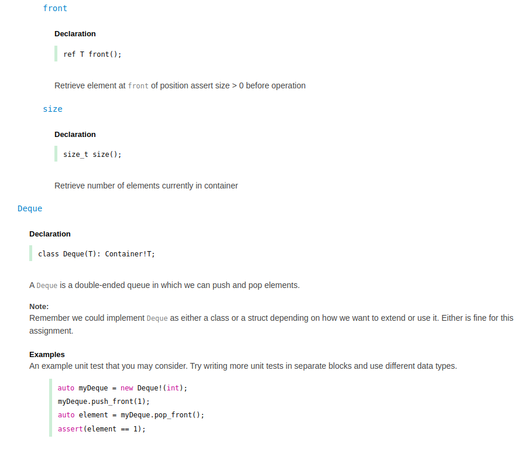

# Part 2 

> Documentation -- also project management

# Implementation Logistics

- You may use whatever operating system, IDE, or tools for completing this assignment.
	- However, my instructions will usually be using the command-line, and that is what I will most easily be able to assist you with.
- In the future there may be restrictions, so please review the logistics each time.

## Description

For this portion of the project, you are going to learn about documentation using the Documentation generator - ddoc -- [Documentation Generator](https://dlang.org/spec/ddoc.html)


## Software Documentation

Documentation is relatively tricky in the sense that folks either: 1.) do not do it 2.) do document software, but the documentation grows stale (out of date with what the software actual does). 

Poor documentation thus can be a source of bugs. One way to help resolve this is with the use of generating documentation directly from the source and by embedding in directly unittests so at the least we know that the documented sample actually compiles.

## Task 1 - Ddoc 

**Your task** for this part will be to take the [./src/Deque.d](./src/Deque.d) file and use the syntax (e.g. `///  /** **/ /++ ++/`) in the [https://dlang.org/spec/ddoc.html](https://dlang.org/spec/ddoc.html) page to create a documented page. 

### Logistics

At the least, you can mechanically make your `//` a `///` , though I might suggest you look at the [https://dlang.org/spec/ddoc.html](https://dlang.org/spec/ddoc.html) for more interesting comments like [embedding code](https://dlang.org/spec/ddoc.html#embedded_code), [headings](https://dlang.org/spec/ddoc.html#headings), [links](https://dlang.org/spec/ddoc.html#links), and [tables](https://dlang.org/spec/ddoc.html#tables).

```d
/// This is a one line documentation comment.

/** So is this. */

/++ And this. +/

/**
   This is a brief documentation comment.
 */

/**
 * The leading * on this line is not part of the documentation comment.
 */

/*********************************
   The extra *'s immediately following the /** are not
   part of the documentation comment.
 */

/++
   This is a brief documentation comment.
 +/

/++
 + The leading + on this line is not part of the documentation comment.
 +/

/+++++++++++++++++++++++++++++++++
   The extra +'s immediately following the / ++ are not
   part of the documentation comment.
 +/

/**************** Closing *'s are not part *****************/
```


### Generating the documentation

You can use the following command from the root of this folder to generate the documentation:

`dmd -D -Dddocs -od=./bin -of=./bin/prog ./src/*.d`

- This command invokes the dmd compiler
	- `-D -Dddocs` -D tells us to use DDoc, and -Dd tells us where to place the files (the docs folder)
		- It is fine to commit updated documentation in a project in general.
	- `-od=./bin -of=./bin/prog` This tells us to place the binary files in the 'bin' directory (short for binaries).
		- This is a standard practice. Remember, we do not commit binaries, so you can update your git ignore rule to essentially ignore any file in a ./bin directory if you like.

### Expected Output

When you complete, you should see something similar to below.



## Deliverables

- You should have within a folder called [./docs](./docs) the documentation of your [./src/Deque.d](./src/Deque.d) file that was generated using ddoc compiler flags. 

## Going Further

What is that, you finished Early? Did you enjoy this assignment? Here are some (optional) ways to further this assignment.

- Take a look at the dlang or phobos library on github to see how the authors use ddoc to create the website documentation.

# F.A.Q. (Instructor Anticipated Questions)

1. Q: Do I have to use my Deque that is fully implemented?
	- A: No, but I would suggest the output from DDoc will be more satisfying if you do use your previous assignment Deque.

## Found a bug?

If you found a mistake (big or small, including spelling mistakes) in this lab, kindly send me an e-mail. It is not seen as nitpicky, but appreciated! (Or rather, future generations of students will appreciate it!)

- Fun fact: The famous computer scientist Donald Knuth would pay folks one $2.56 for errors in his published works. [[source](https://en.wikipedia.org/wiki/Knuth_reward_check)]
- Unfortunately, there is no monetary reward in this course :)
