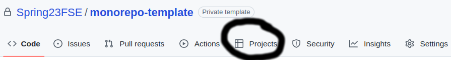
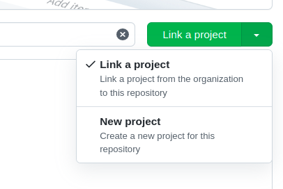
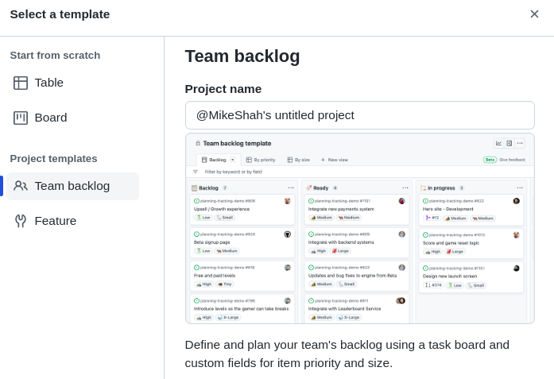
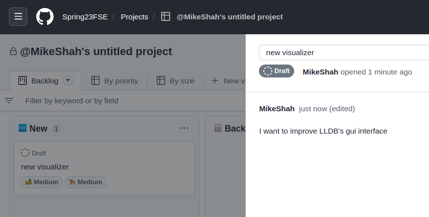

# Warmup

> Github Project Management

# Implementation Logistics

- You may use whatever operating system, IDE, or tools for completing this assignment.
	- However, my instructions will usually be using the command-line, and that is what I will most easily be able to assist you with.
- In the future there may be restrictions, so please review the logistics each time.

## Description

For this portion of the assignemnt, you are going to be using the 'Projects' portion of Github to create a project for this assignment.

## Task 1 - Open source project reading

For this task, you are going to first navigate to [The Architecture of Open Source Applications](http://aosabook.org/en/index.html). There are two texts with about 50 different projects (e.g. [GDB](http://aosabook.org/en/gdb.html), [Git](http://aosabook.org/en/git.html), GNU Mailman, [matplotlib](http://aosabook.org/en/matplotlib.html), [LLVM](http://aosabook.org/en/llvm.html), [Jitsi](http://aosabook.org/en/jitsi.html), Graphite, [Eclipse](http://aosabook.org/en/eclipse.html), [CMake](http://aosabook.org/en/cmake.html), etc.).

Your **First Task** will be to *read a selected chapter* on a project of your choice. Choose something that is of interest to you that you want to further explore.

## Task 2 - Project Management

Now that you have read about a new project (or perhaps a project that you knew about), you are going to document a feature that you might like to add to that project.

1. Navigate to the 'Projects' portion of github and create a new project
	- 
	- Create a new project using your first name, last name, and the project you studied (e.g. Mike Shah - LLDB)
	- Use the 'Team backlog template' (If you do not use the template, either delete your board, or just add a New/Backlog/Ready/InProgress/InReview column)
	- 
2. Once your project is created
	- **Your task** is to create and add '5' new items into the Project board.
    - You should create issues that you "imagine" might be real for the given project.
    - You can move them wherever you like ('new', 'backlog', 'ready', etc.)
	- 

## Deliverables

- You should have your name and a project with 5 items in the FSE organizations project log.

## Going Further

What is that, you finished Early? Did you enjoy this assignment? Here are some (optional) ways to further this assignment.

- Take a look at Jira as another example project management tool.

## Found a bug?

If you found a mistake (big or small, including spelling mistakes) in this lab, kindly send me an e-mail. It is not seen as nitpicky, but appreciated! (Or rather, future generations of students will appreciate it!)

- Fun fact: The famous computer scientist Donald Knuth would pay folks one $2.56 for errors in his published works. [[source](https://en.wikipedia.org/wiki/Knuth_reward_check)]
- Unfortunately, there is no monetary reward in this course :)
