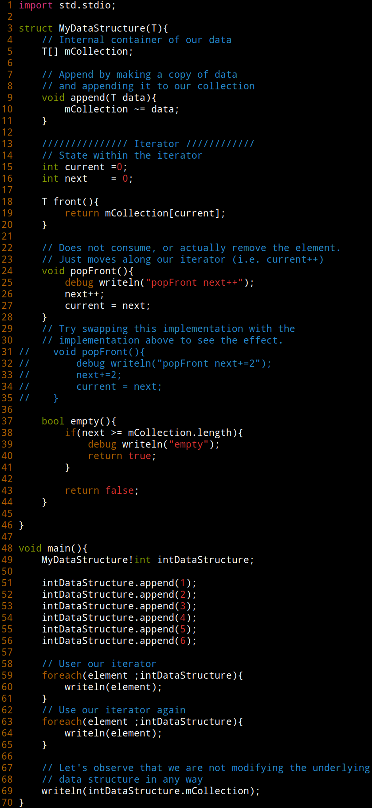

# Iterator Behavioral Design Pattern

# Implementation Logistics

- You may use whatever operating system, IDE, or tools for completing this assignment.
	- However, my instructions will usually be using the command-line, and that is what I will most easily be able to assist you with.
- In the future there may be restrictions, so please review the logistics each time.

# Resources to help

Provided below are a list of curated resources to help you complete the task(s) below. Consult them (read them, or do ctrl+f for keywords) if you get stuck.

- See Ali Cehreli's talk  linked below.

# Description

Previously we have learned about what a design pattern is, a flexible template for solving a programming solution. While design patterns are not perfect, they are often a useful starting point for solving a common problem.

The pattern we are going to look at in this section is the **iterator** pattern, which is a behavioral design pattern.

In the D language (or any other languagee really), iterators are a tool for allowing us to traverse a data structure in a known manner. That is, iterators are a way to sequentially visit every element in a data structure. Knowing how to implement our own iterators is useful for a few reasons:

1. This allows us to use our data structures in 'foreach' loops, which are convenient for clients of our code and ourselves to use.
2. We can potentially avoid bugs by avoiding reimplementing code for traversals.
3. Depending on how we implement our iterators, we can get access to [std.parallel](https://dlang.org/phobos/std_parallelism.html) to make our traversals take place in parallel (This largely depends on the data structure).
4. Pragmatically, some programmers may not know how to implement traversals on a graph data struture (e.g. DFS, BFS, Shortest-Path, etc. may all be nice traversals to have available.)
5. Probably most importantly, an iterator allows us to avoid exposing the internals of a data structure to our user. We really do not want a user of our data structure manually moving pointers or indices around to visit the data within the structure.

## Task 0 - Enrichment

For your enrichment I would recommend watching this section of a guest lecture at Northeastern University on iterators (and also iterators for handling infinite sequences): https://youtu.be/0JL9uT_XGZE?t=2860 - Ali Cehreli

It may be useful to otherwise watch the entirety of the video, but at least watch the section on implementing an iterator, as I think it would be useful.

## Task 1 - Creating an iterator

 

You'll observe to the right that I have implemented an iterator. Your goal is going to be to recreate this code sample in the [./src/iterator.d](./src/iterator.d ) file. **The code provided will not compile** until you actually implement 3 special member functions: empty, front, and popFront.

1. empty - This is how to determine when you are at the end of a data collection. This might be when you reach the end of an array for example, or in a linked list when you reach a null pointer.
2. front - This is how to access the current data that you are looking at (during the iteration of a loop)
3. popFront - This is not mutating the data struture, but rather the algorithmic portion of how to 'move to the next' piece of data.

**A solution** is provided in image form to the right that you can otherwise show you the individual components of an iterator.

### Enrichment 

You can learn quite a bit by looking at the standard library source code in the D programming language. Observing how some of the data structures have been implemented can be useful, and how the ranges are organized.

- Observe DList for instance here: https://github.com/dlang/phobos/blob/master/std/container/dlist.d
- Observe how the 'current' and 'next' iterator variables are used. (and how they're named, sometimes harder to type with `_` leading the varaible

For further enrichment -- see [opApply](https://tour.dlang.org/tour/en/gems/opdispatch-opapply) as an alternative for implementing an iterator.

### Why does the iterator work?

Understanding exactly how an iterator is implemented may provide some insight to otherwise understanding how the implementation works.

You can compile your iterator.d with: `dmd -vcg-ast iterator.d` and this will generate d code with templates expanded (i.e. this is the actual D code that gets generated). Observe that in the code below there is no 'foreach loop', it is just generated as a 'for' loop in its own scope where a separate copy of the 'intDataStrutcture' is manipulated.

```d
   40 void main()                                                                                                             
   41 {                                                                                                                       
   42     MyDataStructure!int intDataStructure = 0;                                                                           
   43     intDataStructure.append(1);                                                                                         
   44     intDataStructure.append(2);                                                                                         
   45     intDataStructure.append(3);                                                                                         
   46     intDataStructure.append(4);                                                                                         
   47     intDataStructure.append(5);                                                                                         
   48     intDataStructure.append(6);                                                                                         
   49     {                                                                                                                   
   50         MyDataStructure!int __r42 = intDataStructure;                                                                   
   51         for (; !__r42.empty(); __r42.popFront())                                                                        
   52         {                                                                                                               
   53             int element = __r42.front();                                                                                
   54             writeln(element);                                                                                           
   55         }                                                                                                               
   56     }                                                                                                                   
   57     {                                                                                                                   
   58         MyDataStructure!int __r78 = intDataStructure;                                                                   
   59         for (; !__r78.empty(); __r78.popFront())                                                                        
   60         {                                                                                                               
   61             int element = __r78.front();                                                                                
   62             writeln(element);                                                                                           
   63         }                                                                                                               
   64     }                                                                                                                   
   65     writeln(intDataStructure.mCollection);                                                                              
   66     return 0;                                                                                                           
   67 }
```

You might be wondering how to 'reset' your iterators values when doing popFront for instance (i.e. where we modify next++). One interesting note is that in each of our 'foreach' loops (which got transformed into a `for (; !__r##.empty(); __r##.popFront())` loop) are 'copies' of the initial 'intDataStructure' shown above. So yes, if you define a copy constructor and print out 'copy' or some message, you will indeed see a copy being made. I encourage you to otherwise try changing some parameters (e.g. make your 'foreach(element ...)' a 'foreach(ref element' ...) style loop and observe the changes).

## Testing

- Run with `rdmd iterator.d` to test your implementation
	- (Optional) Try running with `rdmd -debug iterator.d` for additional debug output to see the statements and what is going on.
	- (Optional) Implement a copy constructor

# Submission/Deliverables

### Submission

- Commit all of your files to github, including any additional files you create.
- Do not commit any binary files unless told to do so.
- Do not commit any 'data' files generated when executing a binary.

### Deliverables

- Task 1
	- Complete the implementation of the iterator
	- Add at least 3 unittest blocks to test out the data structure

# Going Further

An optional task(if any) that will reinforce your learning throughout the semester--this is not graded.

1. N/A

# F.A.Q. (Instructor Anticipated Questions)

1. Q: N/A
