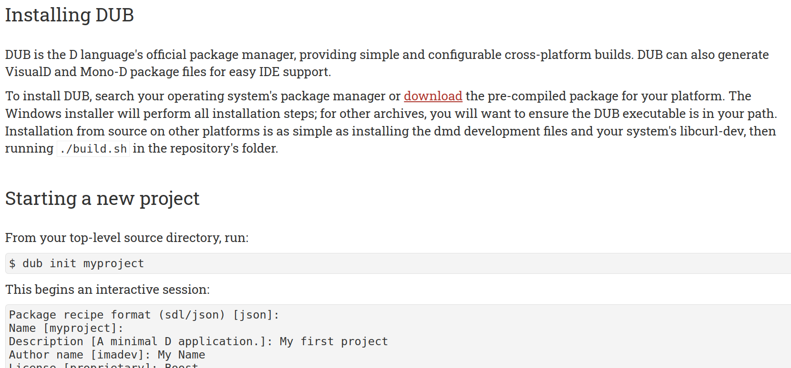
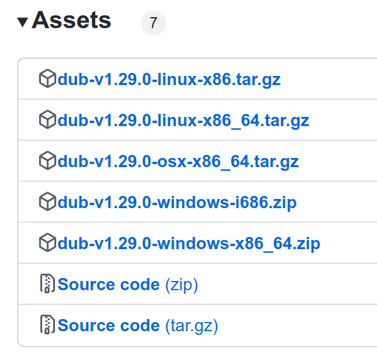
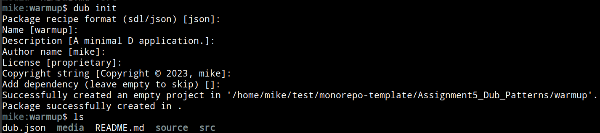

# Warmup

> Dub Package Management

# Implementation Logistics

- You may use whatever operating system, IDE, or tools for completing this assignment.
	- However, my instructions will usually be using the command-line, and that is what I will most easily be able to assist you with.
- In the future there may be restrictions, so please review the logistics each time.

## Description

For this portion of the assignemnt, you are going to setup [Dub](https://code.dlang.org/) which is the official package management tool for the D programming language. Below is a screenshot of the Dub package management setup page found here: https://dub.pm/getting_started.html

## Task 1 - Downloading and Installing Dub

Dub can be downloaded and installed from most package managers on your operating system. Note that, many of you when you installed the dmd compiler may already have 'dub' installed. So try trying 'dub' on the terminal first to see if it is working.

### Installing Dub

- The **releases** for Dub are hosted here: https://github.com/dlang/dub/releases
	- You can scroll down and click 'Assets' and you should find an archive file for your operating system
	- 
- Dub installed through operating system package managers
	- Linux:
		- For folks who installed dmd, you should already have dub.
		- Otherwise, you can try `sudo apt-get install dub` 
	- Mac:
		- If Mac users were unable to install through the 'releases' on github, then you can try:
		- Installing https://brew.sh/ - a package manager for Mac that you use on the terminal.
		- Then try `brew install dub` on the command line (and wait a few seconds or minutes to install)
		- Note: Some Mac users may get errors and need to run: `export MACOSX_DEPLOYMENT_TARGET=11` before running dub.
	- Window: 
		- It is also likely that if you setup dmd, you should be able to use dub from the terminal as well.
		- Windows folks should be able to install from the zip file and the releases if they otherwise do not have dub available.

## Task 2 - Project Management and using dub

Dub is useful because it itself helps manage the dependencies, and the specific versions of those dependendcies for that. This can help for especially long lived projects -- meaning that you can simply 'rebuild from source' with less worry. Packages are also hosted by dlang officially (and typically fetching code from github), so again there is infrastructure for supporting longer lived projects.

### Creating a dub project

In this directory (./Assignment5_Dub_Patterns/warmup) I'd like you to run the following commands.

- `dub init`
- Then just add anything you like to the name or description of the project.
- Observe the following output of your project
	- 
	- Note that a 'source' folder ws created, and a 'dub.json' file that was created with your project configuration.
- Now try typing `dub` or `dub run` to build your project.
	- Your program will execute and print out a line of text by default from the main of the source/app.d file.

## Task 3 - Creating a bindbc-SDL project

In order for dub to be useful, we should add a dependency or otherwise use dub to build a dlang project.

1. Download the course repository -- specifically the ./5/project module: https://github.com/MikeShah/C-SoftwareEngineering/tree/master/5/project
2. Try running 'dub' within the ./project directory.
	- At this stage, the 'project' **may** or **may not** work -- why?
	- Well, this dub project uses a dependency known as bindbc-sdl - https://code.dlang.org/packages/bindbc-sdl/0.21.4.
	- bindbc-sdl is a 'D language binding' to a 'C language library'
	- What that means, is there is a D interface to calling C language functions -- the D programming language is highly compatible with the C programming language, and that gives us access to lots of code!
	- But that doesn't answer the 'failure' as to why your project may not have worked.
3. Understanding Bindings
	- The 'binding' to the Simple Directmedia Layer (SDL) C functions is not enough, we need the 'implementation' code in the library.
	- If you are on a linux machine, this means you need the shared library file (.so), on a Mac you need the .dylib, and on a windows machine you need the .dll.
		- .so, .dylib, and .dll are the compiled code, and are compiled such that we can import into other projects this specific library.
	- For your operating system, you will need to install the SDL Libraries.
4. Installing the SDL Libraries
	- Linux:
		- Type in : `sudo apt-get install libsdl2-dev`  
		- Review this video if you have difficulty: https://www.youtube.com/watch?v=P3_xhDIP7bc&list=PLvv0ScY6vfd-p1gSnbQhY7vMe2rng0IL0&index=3
	- Mac:
		- Follow the first 2minutes and 13 seconds of this video: https://www.youtube.com/watch?v=V6ACATpl2LQ&list=PLvv0ScY6vfd-p1gSnbQhY7vMe2rng0IL0&index=5 
	- Windows: 
		- Follow this tutorial for setting up SDL: https://youtu.be/DQ-NBjBFLJ4?t=454
		- Note: If you have mingw setup, this is all you need to do.

**Your Task**: is to be able to build the SDL project successfully. YOu should be able to run the ./project by just typing in 'dub' in the directory.

**Note**: I will reserve this location for supplementary video instructions if there is difficulty in this assignment then you can check this folder: https://drive.google.com/drive/folders/1u9UhrHmuQmibQMRQWhYV2-XOEo8k5ghe?usp=sharing

### Aside

Using dub to build documentation: `dub --build=docs`

## Deliverables

- You should commit your empty dub project folder to this repo from task 2 so I know that dub is working on your machine.
- You should take a screenshot named [sdl.jpg](./sdl.jpg) showing that you were able to get the screensaver test project working in task 3 with dub.

## Going Further

What is that, you finished Early? Did you enjoy this assignment? Here are some (optional) ways to further this assignment.

- Try playing around with SDL!
- Try investigating the 'make' build system.

## Found a bug?

If you found a mistake (big or small, including spelling mistakes) in this lab, kindly send me an e-mail. It is not seen as nitpicky, but appreciated! (Or rather, future generations of students will appreciate it!)

- Fun fact: The famous computer scientist Donald Knuth would pay folks one $2.56 for errors in his published works. [[source](https://en.wikipedia.org/wiki/Knuth_reward_check)]
- Unfortunately, there is no monetary reward in this course :)
