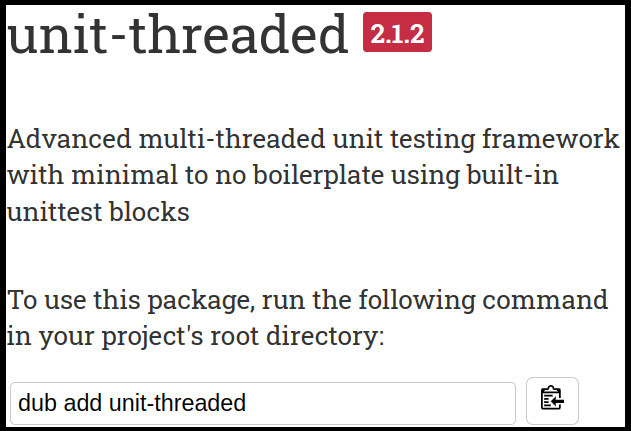

# unit-threaded




> "Better testing, means better software"


# Implementation Logistics

- You may use whatever operating system, IDE, or tools for completing this assignment.
	- However, my instructions will usually be using the command-line, and that is what I will most easily be able to assist you with.
- In the future there may be restrictions, so please review the logistics each time.

Our ability to test becomes very important as we want to write software that runs on multiple platforms, as well as ensure our software works as we add new features over a long period of time. There exist many testing frameworks in our software that we can work with, and for this assignment we are going to use a popular framework called [unit-threaded](https://code.dlang.org/packages/unit-threaded). unit-threaded is a relatively simple but powerful framework that builds on top of the basic 'unittest {}' blocks provided in the D programming language.

# Resources to help

Provided below are a list of curated resources to help you complete the task(s) below. Consult them (read them, or do ctrl+f for keywords) if you get stuck.

1. unit-threaded
	- Advanced multi-threaded unit testing framework with minimal to no boilerplate using built-in unittest blocks
		- https://code.dlang.org/packages/unit-threaded
2. unit-threaded demo
	- https://www.youtube.com/watch?v=vNPb4Mg6F6Y#t=6m50s

# Task 1 - Writing a Test

We have previously looked at writing tests before. However, as projects scale, we often times need the ability to have more control of our unit tests. With a large enough project, running unit tests can also take a lot of time (note however, that those unit tests usually become automated as part of the build system). So in order to handle the increasing amount of unit tests, we will utilize a multithreaded unit testing framework.

## unit-threaded

[unit-threaded](https://code.dlang.org/packages/unit-threaded) is one of the most popular frameworks in the D programming langauge--it was created by one of the maintainers of the D programming language Atila Neves. It has many capabilities for writing and creating tests.

For this portion of the assignment, you are going to be using unit-threaded.

## Your Task

- [ ] Create a new project using `dub init` in this current directory where this README.md file exists.
	- You should add a dependency for **unit-threaded** during the startup of the project
	    - NOTE: I am using unit-threaded 2.1.2 for this test, so use this version or otherwise tthe latest version available.
	    - https://code.dlang.org/packages/unit-threaded
    - You should add a dependency for **bindbc-sdl** as well.
        - https://code.dlang.org/packages/bindbc-sdl
	- We want to now practice working with multiple dependencies on our project.

### Test cases

After you have created the sample project with the unit-threaded and bindbc-sdl dependencies, modify [./dub.json](./dub.json) with the following code.

**Note**: It's worth looking at https://code.dlang.org/packages/unit-threaded to understand how this works.

```json
{
	"authors": [
		"mike"
	],
	"copyright": "Copyright © 2023, mike",
    	"targetType": "executable",
    	"targetPath": "bin",
    	"configurations":[
        {"name":"executable"      },
        {
            "name":"unittest",
            "preBuildCommands": ["dub run unit-threaded -c gen_ut_main -- -f bin/ut.d -d dub"],
            "mainSourceFile":"bin/ut.d",
            "excludedSourceFiles": ["source/app.d"],
            "dependencies": {
                "bindbc-sdl": "~>1.2.4",
                "unit-threaded": "~>2.1.2"
            },
        }
    ],
	"description": "A minimal D application.",
	"license": "proprietary",
	"name": "part1"
}
```

What we have done at the top is added another configuration that will run specifically with `dub test`, but now we are taking advantage of unit-threaded which runs all of our tests in parallel. Let's try to understand now some of the different pieces of the dub configuration file.

- "configurations" specifies what to do during a build specifically when we use 'version' in dlang.
	- Note: 'unittest' is a predefined [version](https://dlang.org/spec/version.html#version) specifier stating that we conditionally compile our code when we compile with: `rdmd -version=unittest ./source/app.d` or otherwise with `dub test`.
	- Thus, 'name' == 'unittest' is the specific configuration to build dub with.
- Under our 'unittest' configuration, we have a 'preBuildCommands' that will generate a special file for us in dub.
	- The file will be built in a 'bin' directory that effectively creates a 'test runner' or in otherwords, a file that will just run tests. It works by using a 'mixin', that adds all of our code into one file, thus adding all of the unittest blocks.
	- Next, we have `"excludedSourceFiles": ["source/app.d"]`, indicating that we do not want another 'main()' function to be in our program. We only want to execute our unittest blocks.
	- And finally, we have our dependencies, which in this case are SDL and unit-threaded.


### Testing our project

Add the following files to your project:

```d
// ./source/test.d
@("some other test in test.d")
unittest{
    assert(2==2,"2==2 should pass");
}
```

```d
// ./source/test2.d
@("some other test in test2.d")
unittest{
    assert(3==3,"3==3 should pass");
}
```

Now you should be able to run `dub test`. If setup properly, you will be able to see two tests have passed, and the name of the file and the name of the test (specified by @("test name")). 

```bash
To force a rebuild of up-to-date targets, run again with --force.
Running ../../../../.dub/packages/unit-threaded-2.1.2/unit-threaded/gen_ut_main -f bin/ut.d -d dub
Linking...
To force a rebuild of up-to-date targets, run again with --force.
Running bin/part1 
test.some other test in test.d:
test2.some other test in test2.d:

Time taken: 406 μs and 6 hnsecs
2 test(s) run, 0 failed.

OK!
```

## Your Task

If you successfully see the output above, you are complete.

## Testing

- Task 1
	- Run with `dub test`

# Submission/Deliverables

- Commit the [dub.json](./dub.json), associated tests ([./source/test.d](./source/test.d) and [./source/test2.d](./source/test2.d)) to this repository.

### Submission

- Commit all of your files to github, including any additional files you create.
- Do not commit any binary files unless told to do so.
- Do not commit any 'data' files generated when executing a binary.

# Going Further

An optional task(if any) that will reinforce your learning throughout the semester--this is not graded.

- N/A

# F.A.Q. (Instructor Anticipated Questions)

1. Q: Can we use xUnit
	- A: No, I'd like everyone to use unit-threaded for this assignment.
