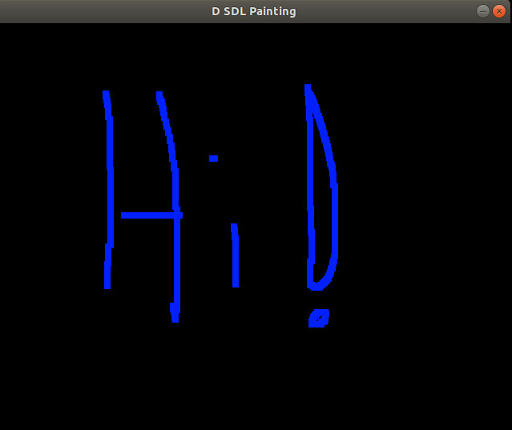

# Painting

> Painting with SDL.

# Implementation Logistics

- You may use whatever operating system, IDE, or tools for completing this assignment.
	- However, my instructions will usually be using the command-line, and that is what I will most easily be able to assist you with.
- In the future there may be restrictions, so please review the logistics each time.

# Resources to help

Provided below are a list of curated resources to help you complete the task(s) below. Consult them (read them, or do ctrl+f for keywords) if you get stuck.

1. Painting in SDL
	- https://www.youtube.com/watch?v=dUlWUcugA9A&list=PLvv0ScY6vfd-p1gSnbQhY7vMe2rng0IL0&index=15

## Description

For this portion of the assignment, you are provided with an SDL application where we can 'paint pixels' onto the screen. Effectively, what we are doing is changing the color values (Red, Green, and Blue) on an SDL_Surface (An SDL_Surface holds pixels values). You can observe the starter code to see how this is working.

There is one problem however -- how would we test a graphical application?


### Graphics Project

Provided in this code repository is a 'graphics_project' folder. You can run with `dub` or `dub run` to observe how the application works (left-clicking draws blue pixels). The project has been initialized with dub and the [bindbc-sdl](https://code.dlang.org/packages/bindbc-sdl/0.21.4) dependency.

The problem with our painting application, is that we have low confidence in our ability to test the application. In fact, the whole application was built without us even thinking about testing in mind! YIKES!

### Task - Code refactor

1. The first thing that you will need to do, is create an abstraction around some of the classes in SDL. 
	- Meaning that we probably want an SDL application to be its own class and in its own file.
	- For example:
		```d
			class SDLApp{
				this(){
					// Handle initialization...
					// SDL_Init
				}
				~this(){
					// Handle SDL_QUIT
				}
				
				// Member variables like 'const SDLSupport ret'
				// liklely belong here.
				
				void MainApplicationLoop(){ ... }				
				
			}
		```
	- You also will likely want abstractions around things like SDL_Surface in its own file.
		- For example
		- ```d
			struct Surface{
				this(...) {
					// Create a surface...
				}
				~this(){
					// Free a surface...
				}
				
				// Update a pixel ...
				// SomeFunction()
				
				// Check a pixel color
				// Some OtherFunction()
			}
		  ```
	- Once you have successfully abstracted your design, your 'main' function becomes relatively trivial
		- ```d
			void main(){
				SDLApp myApp;
				myApp.MainApplicationLoop();
			}
		  ```
	
### Testing

Once you have refactored your project, and you are able to recreate the original behavior, it's time to add some tests.

1. Incroprate [unit-threaded](https://code.dlang.org/packages/unit-threaded) from the previous portion of the assignment.
2. Write 3 named unit tests that test a graphical aspect of the applicatin.
	- e.g.
	- ```d
		// pseudo-code
		@("some test name")
		unitttest{
			Surface s;
			s.changePixel(x,y,b,g,r);
			assert(	s.PixelAt(x,y).b == value1 && 
				s.PixelAt(x,y).g == value2 &&
				s.PixelAt(x,y).r == value3, "error bgr value at x,y is wrong!");
		}
	  ```

## Advice

- Refactor the code first after you understand a little bit about what the graphics application is working.
- As always, git add, git commit, and git push often.
- Refer back to the previous section if you need help setting up unit-threaded.

**Note**: I will reserve this location for supplementary video instructions if there is difficulty in this assignment then you can check this folder: https://drive.google.com/drive/folders/1u9UhrHmuQmibQMRQWhYV2-XOEo8k5ghe?usp=sharing

# Submission/Deliverables

- We will run `dub test` on your refactored graphics_projet, and should see at least 3 passing tests that test a graphical aspect of the project (e.g. Surface pixel colors).

# Going Further

An optional task(if any) that will reinforce your learning throughout the semester--this is not graded.

1. N/A

# F.A.Q. (Instructor Anticipated Questions)

1. Q: Should I split my code into separate files
	- A: Yes, that in fact iw one of the takeaways that our 'app.d' where main() resides, shoud be fairly clean. We don't even want unittests in the app.d where main resides. It makes it hard to test our application with unit-threaded.
