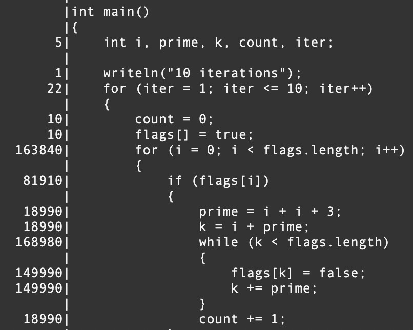

# Code Coverage

> Tests need to actually 'cover' your programs functionality

For your warmup today, you will be revisiting your Data Structure assignment (Deque) and running a code coverage report on the assignment.

# Implementation Logistics

- You may use whatever operating system, IDE, or tools for completing this assignment.
	- However, my instructions will usually be using the command-line, and that is what I will most easily be able to assist you with.
- In the future there may be restrictions, so please review the logistics each time.

# Resources to help

Provided below are a list of curated resources to help you complete the tasks below. Consult them (read them, or do Ctrl+f for keywords) if you get stuck.

- Task 1
	1. cov
        - https://dlang.org/articles/code_coverage.html
			- Built-in code coverage analysis

# Task 0 - Code Coverage

## cov

For the warmup you are going to run a tool called 'cov' that is part of the D programming language, and execute the coverage on your Deque data structure.

> A major part of the engineering of a professional software project is creating a test suite for it. Without some sort of test suite, it is impossible to know if the software works at all. The D language has many features to aid in the creation of test suites, such as unit tests and contract programming. But there's the issue of how thoroughly the test suite tests the code. The profiler can give valuable information on which functions were called, and by whom. But to look inside a function, and determine which statements were executed and which were not, requires a code coverage analyzer.

Code coverage can be one way to see what code is actually running, and thus (a) where you should spend either more time writing tests (b) how you can improve your test suite to exercise as many branches of your code as possible to make sure your codebase works.

### How to use DLang code coverage

The DMD compiler (and LDC2 and GDC) have support for code coverage. I've provided some [examples](./examples) that you can use if you'd like.

1. First we need to compile our program such that it is going  to be 'instrumented' to capture additional data: 
	- `dmd simple.d -cov -of=prog`
2. Now that our program has been instrumented, we can run it.
	- `./prog`
	- After running the program, you will see a new file generated ending in '.lst' which has the code coverage profile of the last execution of the program.
		- Typically for each module that is run, a .lst file with that module will be generated (e.g. simple.lst)
3. Open up and review the module.

Now again, depending on what code executes, that is what .lst file will be generated.

1. Repeat the first example, but this time for your unittest suite.
	- Note: I'll use rdmd for this for brevity.
	- `rdmd -unittest -cov simple.d`
2. Observe the results -- you should see that your unit tests now have been executed, and the associated code exercised by your unit tests will be displayed.

## Task 1 - Revisiting Deque

Your task is to run the code coverage tool on your Deque data structure to see how well you really tested your Deque.d (we gave a quick check when we reviewed your tests, but now you will really know!)/

1. Run the -cov tool on your unittest blocks for your Deque assignment.
2. If you do not have 100% code coverage, modify your assignment 2 until you have 100% coverage reported.
3. Capture in a screenshot your final result from the Deque.lst file.

**Note**: Assuming your Deque assignment has already been graded, you can commit your changes to the Deque assignment directory if you like.

### Using dub for code coverage

I've included one more example in the [./examples](./examples) directory on using dub for unit testing. You can explore the source code as you like.

1. This will run the unit tests and report on the code coverage. 
	- `dub -b unittest-cov`
2. This will run just the project, and capture code coverage information.
	- `dub -b cov`

Note: There is an interesting project here if you'd like to do more code coverage with dub that can improve the output of code coverage: https://code.dlang.org/packages/covered/1.0.0

## Testing

- Revisit your Deque assignment folder and run with the '-cov' flag.
	- i.e. `rdmd -cov -unittest Deque.d`

# Submission/Deliverables

- Task 1
	- Capture a screenshot called [cov.jpg](./cov.jpg) and upload it to this directory showing that you have obtained 100% code coverage of your Deque.
		- (i.e. after you upload the file, clicking the link above should show a picture with 100% code coverage)
	
### Submission

- Commit all of your files to github, including any additional files you create.
- Do not commit any binary files unless told to do so.
- Do not commit any 'data' files generated when executing a binary.

# Going Further

An optional task(if any) that will reinforce your learning throughout the semester--this is not graded.

1. Try implementing more design patterns that you have learned today!

# F.A.Q. (Instructor Anticipated Questions)

1. Q: Can we always achieve 100% code coverage on every software project?
	- A: In practice, as software scales, the answer might be no -- but we should always strive for it.
	- Atriving for unit tests and 100% code coverage may be required for domains (automobile, aircraft, etc.) where safety however is paramount!
	- Thus, you might need more advanced testing technqieus (e.g. symbolic execution) to push your program into as many possible execution paths as feasible.
